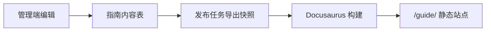

# 数据库内容源

## 推荐路径

数据库中的指南内容先由后台发布流程导出为 Markdown、MDX 或 JSON 快照，再由 Docusaurus 构建读取。



## 原因

- Docusaurus 的核心优势是静态站点生成。
- 构建期读取快照可以缓存内容，访问端无需反复查库。
- 管理端仍负责鉴权、编辑、审核和发布。

## 第一阶段数据格式

```json
{
  "slug": "quick-start",
  "title": "快速开始",
  "category": "入门",
  "content": "# 快速开始\n\n这里是指南正文。",
  "updatedAt": "2026-06-15T00:00:00+08:00"
}
```

后续可将快照转换为 `docs/*.md`，并自动维护 `sidebars.ts`。
